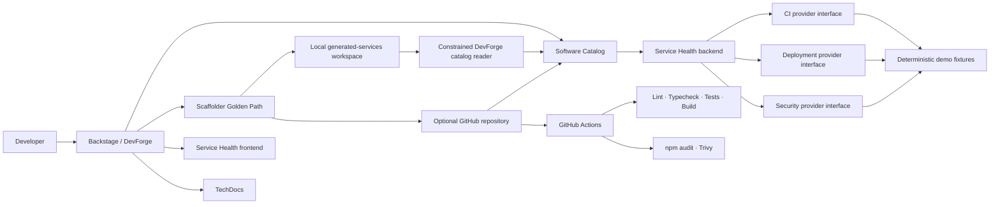

# DevForge

**Backstage + Platform Engineering + Developer Experience + DevSecOps**

[](https://github.com/YouFoundTheDev/devforge/actions/workflows/ci.yml)
[](https://backstage.io)
[](https://www.typescriptlang.org/)

DevForge is a **portfolio/reference implementation** of an Internal Developer
Platform built on Backstage. It demonstrates catalog-driven service discovery,
a custom service-health plugin, a self-service service template, CI/security
scanning, and TechDocs. It is a local demo—not a production deployment.

## 1. Project overview

DevForge gives engineers a single place to discover services, understand owners
and dependencies, scaffold a standard Node.js service, and review demo health
signals. Its golden path can publish to GitHub when configured, or generate and
register a service entirely on the local machine with no credentials.

## 2. Architecture



## 3. Features

- **Software Catalog:** DevForge system, service and library components, APIs,
  PostgreSQL and Redis resources, ownership groups, and dependency relations.
- **Service Health plugin:** an entity page showing CI, deployment, security,
  documentation, dependencies, recent deployments, and an aggregate score.
- **Mock mode:** deterministic backend fixtures are enabled by default and
  clearly labeled in the UI.
- **Golden Path:** a production-oriented Node.js + TypeScript scaffold with
  `/health`, tests, Docker, GitHub Actions, security checks, and TechDocs pages.
- **Local-first workflow:** local generation and Catalog registration require no
  GitHub account or credentials.
- **Optional GitHub publishing:** use the same template to create a repository
  when a GitHub integration and token are configured.
- **Platform dashboard:** deterministic catalog, delivery, security, and docs
  summary metrics with shortcuts to the main workflows.

## 4. Quick start

Requirements: Node.js 22 or 24 and Yarn 4.13 (Corepack is recommended).

```sh
corepack enable
yarn install
yarn start
```

Open <http://localhost:3000>. Mock mode is enabled by default. Use **Create** →
**Create Production Service** to run the local golden path. Generated repositories
are written to `generated-services/` (ignored by Git) and their Component and
API descriptors are registered in the local catalog.

To validate a generated service:

```sh
cd generated-services/<service-name>
npm ci
npm run lint
npm run typecheck
npm test
npm run build
PORT=3001 npm start
curl http://localhost:3001/health
```

## 5. Configuration

Copy `.env.example` to `.env` as a reference, then export the values in the
terminal before starting Backstage:

```sh
set -a
source .env
set +a
yarn start
```

| Variable | Default | Purpose |
| --- | --- | --- |
| `DEVFORGE_MOCK_MODE` | `true` | Use stable CI, deployment, security, and dependency fixtures. Keep enabled for the standalone demo. |
| `GITHUB_TOKEN` | unset | Optional backend-only GitHub integration credential for repository publishing. Never sent to the frontend. |
| `GITHUB_ORG` | unset | Suggested GitHub owner to select in the template’s repository picker. |

Setting `DEVFORGE_MOCK_MODE=false` disables fixture data. Live CI, deployment,
and security adapters are intentionally not included; their provider
interfaces make those integrations replaceable without presenting fake live
results.

## 6. Plugin architecture

The `service-health` frontend plugin contributes an entity content tab for
service Components. It calls the `service-health` backend API, which aggregates
typed CI, deployment, security, dependency, and documentation providers. Each
provider has a small interface and deterministic demo implementation. Provider
failures are surfaced as partial health data rather than hidden behind a
success-shaped fallback.

The `service-health-common` package contains the shared API contract. The
backend’s Scaffolder module also registers local publishing and catalog actions.
Local descriptor imports use the dedicated `devforge-local` location type: it
accepts only validated service names and `catalog-info.yaml` or `api-info.yaml`
under the configured generated-services directory. Generic filesystem imports
remain disabled.

## 7. Scaffolder workflow

**Create Production Service** collects a service name, description, owner,
language, database, and deployment target. The generated Node.js + TypeScript
service includes:

```text
src/                 HTTP server and GET /health
tests/               Health endpoint test
.github/workflows/   Lint, typecheck, test, build, audit, Docker, Trivy
docs/                Overview, architecture, deployment
catalog-info.yaml    Component metadata and ownership
api-info.yaml        Health API descriptor
```

Without GitHub publishing, files are saved locally and both catalog entities
are registered. With publishing enabled, the standard Backstage GitHub publish
and catalog registration actions are used.

## 8. GitHub integration

The GitHub integration reads `GITHUB_TOKEN` on the backend only. The token is
not embedded in generated files, browser configuration, or task output. Leave
publishing unchecked to use the complete local path without credentials. When
publishing is enabled, select the repository owner (typically `GITHUB_ORG`) in
the repository picker.

## 9. Security and DevSecOps

Generated CI runs `npm audit --audit-level=high` and builds the service
container before scanning it with Trivy for critical and high findings. The
service-health view displays deterministic example security findings and scan
statuses in mock mode; these are illustrative fixtures, not results retrieved
from a live GitHub Actions run.

Never commit a real `.env` file or token. Local catalog registration is
restricted to generated descriptor paths, and the GitHub token remains in
backend configuration.

## 10. TechDocs and design decisions

TechDocs is registered in the frontend and backend. Catalog services point to
their local documentation directories; generated services include a
`mkdocs.yml` and overview, architecture, and deployment pages. The local
TechDocs generator is configured to run in Docker, so building docs requires a
working Docker installation. The rest of the portal and local service
scaffolding do not require external credentials.

This implementation favors Backstage 1.55 APIs, a small set of focused plugins,
in-memory local development storage, and deterministic fixtures over
unnecessary infrastructure. GitHub publishing is optional, and integrations
not backed by a real provider are explicitly reported as unavailable.

## 11. Future improvements

- Implement live GitHub Actions, deployment, and security provider adapters.
- Add broader service-health and generated-service integration tests.
- Add production storage and deployment configurations for a real platform.
- Add organization-specific TechDocs publishing and access controls.

## License

MIT. See [LICENSE](./LICENSE).
